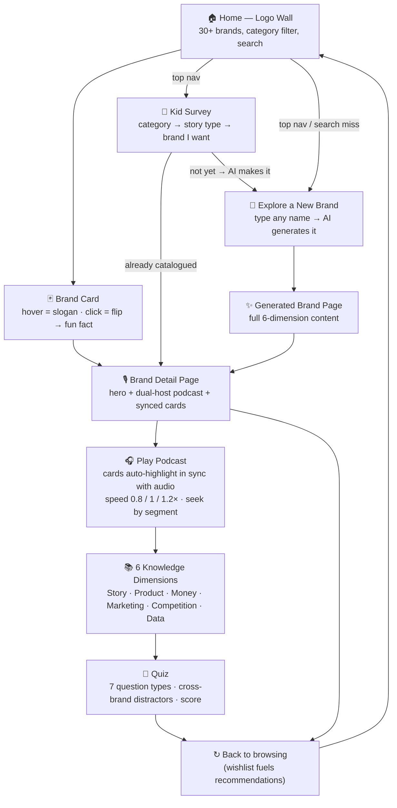
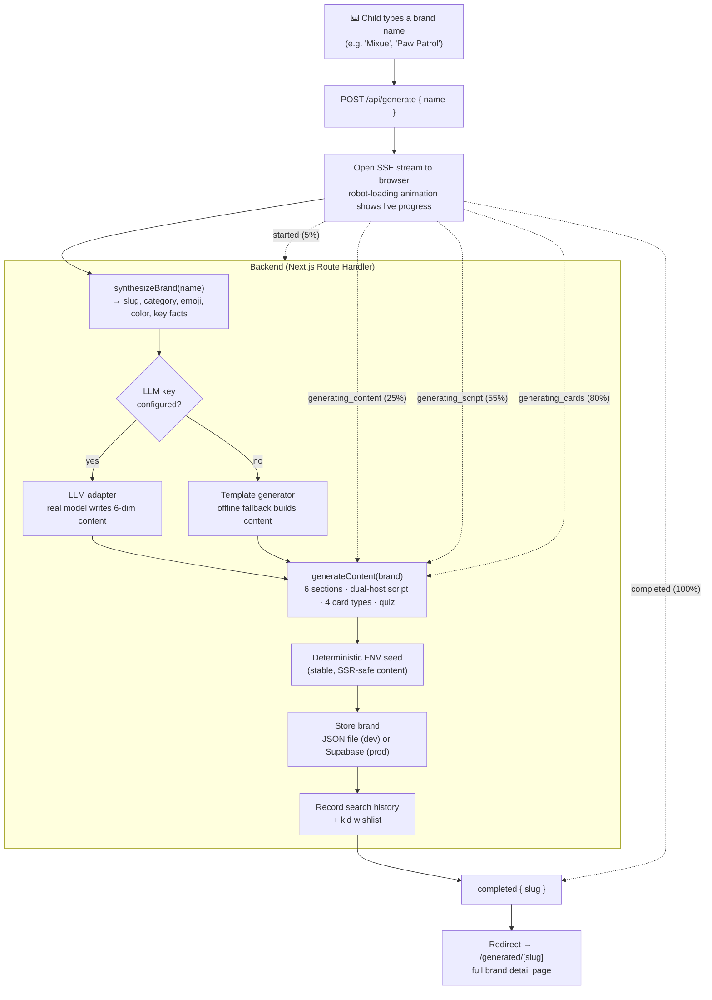
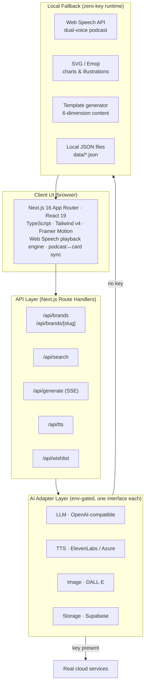

# BrandPedia Kids — Workflow Diagrams

Visual diagrams for the product, the AI generation pipeline, and the system architecture. All diagrams are written in **[Mermaid](https://mermaid.js.org/)** so they render inline on GitHub, VS Code, Typora, and most Markdown viewers, and can be exported to PNG/SVG.

> **To export an image:** paste any diagram block into <https://mermaid.live>, or run `npx mmdc -i input.mmd -o diagram.png` (requires `@mermaid-js/mermaid-cli`).

---

## 1. Product Flow (the child's journey)

This is the end-to-end experience a kid has on the site — from landing on the Logo Wall, into a brand's podcast, through the quiz, and into exploring a brand of their own choice. The learning loop intentionally brings them back to browse again.

**Key mechanism — podcast ↔ card sync:** every podcast segment carries a `cardId`. While a segment plays, its card highlights and scrolls into view, so *what the child hears is what they see* — multimodal learning that is far more memorable than audio or text alone.

---

## 2. AI Generation Flow ("Explore a new brand")

When a child types a brand that is not in the catalog, the backend generates a complete, structured learning bundle and streams progress to the browser in real time via **Server-Sent Events (SSE)**. The same pipeline runs the preset brands; the only difference is the brand metadata source.

**Why this matters:** a single typed brand becomes a *complete lesson* (story, money logic, marketing, quiz, animated chart, timeline) in seconds — the marginal cost of a new brand is near zero, and the child's wishes directly shape what gets built next (the data flywheel).

---

## 3. System Architecture

A clean, four-layer architecture. The defining decision is the **adapter pattern**: each AI/storage capability has a real-service implementation *and* a local fallback, selected by environment variables. The result is a product that runs fully with **zero API keys** and upgrades to enterprise-grade AI with **no code change**.

### How a request flows
1. **Client** renders the page and plays audio via the Web Speech engine (or pre-synthesized audio when a TTS key exists).
2. **API routes** serve brand data, search, the SSE generate stream, TTS lookups, and the wishlist.
3. **Adapters** route each capability to a real service *if the matching env key is set*, otherwise transparently to the **local fallback**.
4. **Fallbacks** keep the product 100% functional offline — the same experience judges get with zero setup.

### Adapter cheat-sheet

| Capability | Real service (env key) | Local fallback (no key) |
| --- | --- | --- |
| Content / script writing | `OPENAI_API_KEY` → OpenAI LLM | Template generator |
| Podcast voices | `ELEVENLABS_API_KEY` / `AZURE_SPEECH_KEY` | Browser Web Speech API (dual voices) |
| Brand illustrations | `OPENAI_API_KEY` → DALL·E | SVG / Emoji |
| Persistence | `USE_SUPABASE` + Supabase creds | Local `data/*.json` |

> **Bottom line:** zero-config demo today → production-grade AI tomorrow, with **zero code migration**. That is the architectural decision that makes BrandPedia Kids simultaneously the most demoable and the most scalable product in the track.
